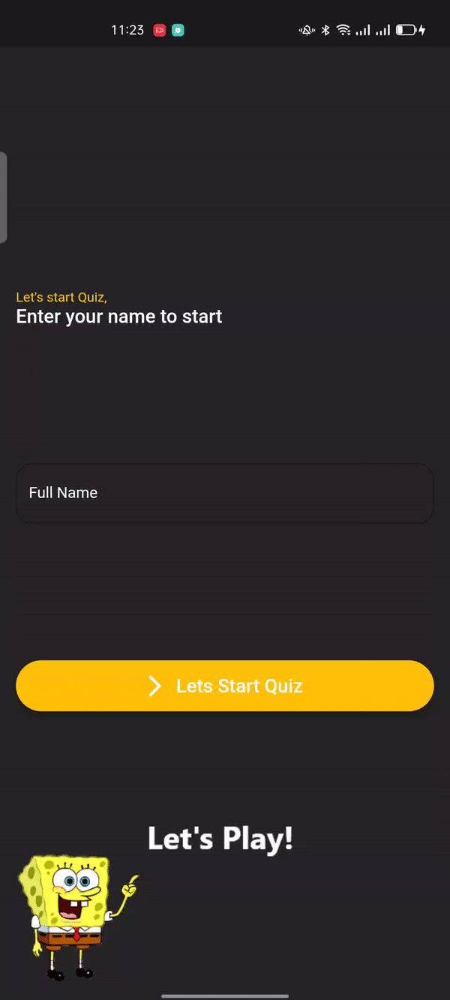
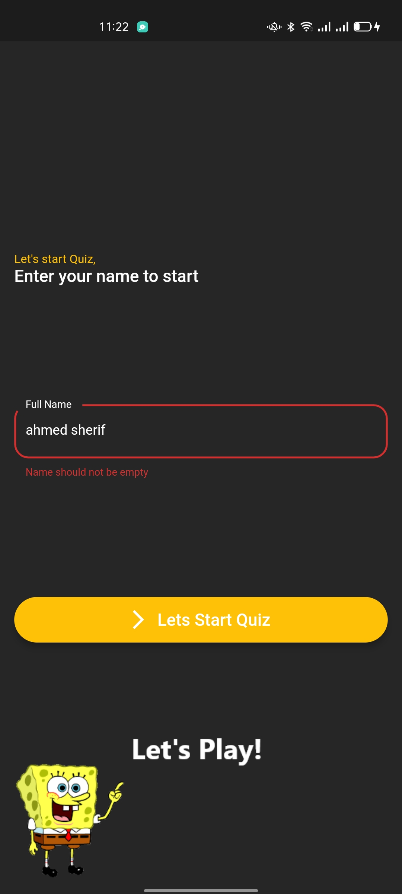
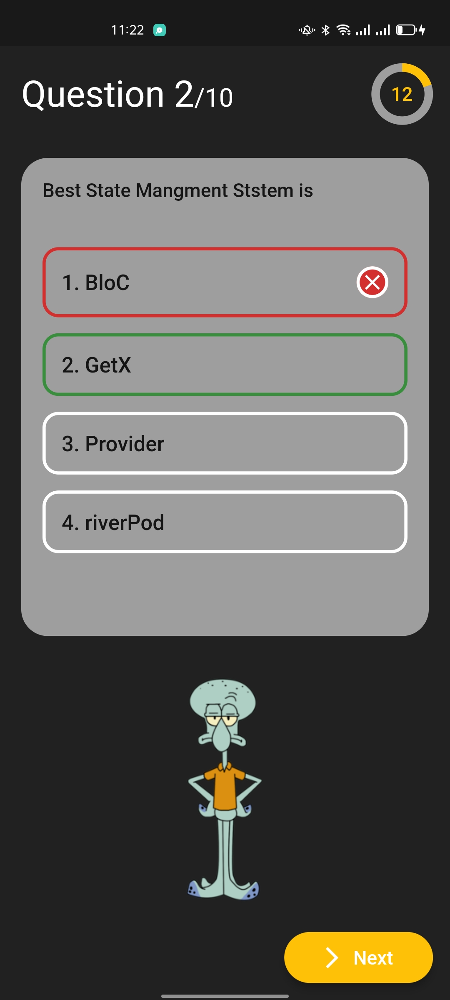
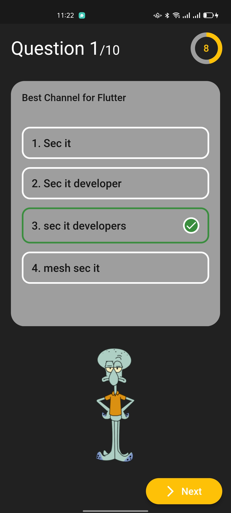
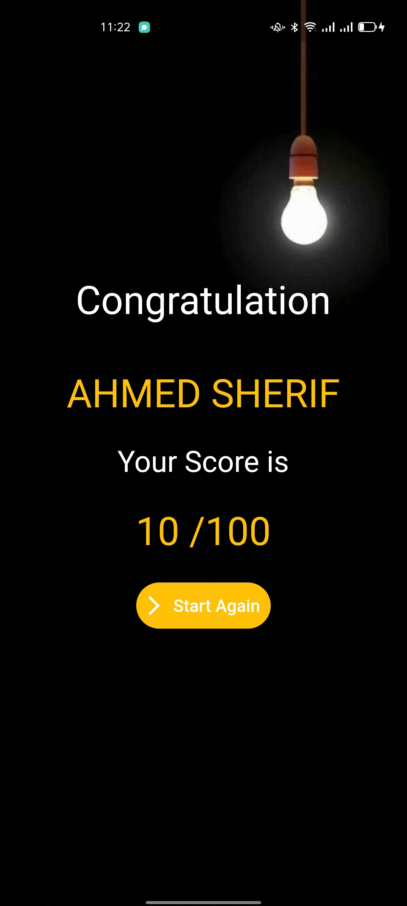

# Quiz App ✍🏻
Quiz App TimeController&GetX [MVC pattern] 👨🏻‍💻

Quiz app is open-source Quiz app for Android & ios. It is built with Dart on top of Google's Flutter Framework.

<b>Quiz App</b>

##:rocket: youtube Tutorial

- Note App by GetX Link: [Note](https://www.youtube.com/watch?v=ZrDK3fG4PO0&t=198s&ab_channel=SecitDevelopers)
- news App Api by GetX Link: [News](https://www.youtube.com/watch?v=MFjoIT3RJSc&list=PLI36SLicSOmKQMPwPauvWDARjzrlQyLIo&index=21&ab_channel=SecitDevelopers)
- Ecommerce App by GetX Link: [MakeUp](https://www.youtube.com/watch?v=-bwiujixOpU&list=PLI36SLicSOmKQMPwPauvWDARjzrlQyLIo&index=3&ab_channel=SecitDevelopers)
- GetX EcoSystem playList Link: [PlayList](https://www.youtube.com/watch?v=8Jy4dtQOZMQ&list=PLI36SLicSOmKQMPwPauvWDARjzrlQyLIo&index=1)

<b>Quiz App</b>

## About🤠

Quiz app using GetX With PageCotnroller & Timer

## Benfit👻
- [🆗] Welcom Screen
- [🆗] Quiz Screen
- [🆗] 10 Question
- [🆗] 100 mark
- [🆗] Score Screen
- [x] [GetX]
- [x] MVC patterns
- [x] Deal With PageController.
- [x] Deal With Timer
- [x] checkAnswer if it True | false
- [x] Content Char Count
- [x] check IsQuestion Answered
- [x] nextQuestion
- [x] resetAnswer
- [✅] startTimer
- [✅] resetTimer
- [✅] stopTimer

## Snapshots

| Welcom Screen
|------
|

| Question One Page | Question Two Dialog|
|------|-------|
|||

| Score Screen
|------
|

## Other Flutter Projects 🔐
- [News App](https://github.com/itsherifAhmed/NewsApp)
- [Device Detail App](https://github.com/itsherifAhmed/device-detail-app)
- [White board Draw App](https://github.com/itsherifAhmed/draw-app)
- [music app player external storage read](https://github.com/itsherifAhmed/Music-Player-Read-external-Storage-Flutter-app)
- [Make Up App flutter MVC Getx](https://github.com/itsherifAhmed/MakeUp-App)
- [Speech to Text app flutter](https://github.com/itsherifAhmed/Speech-to-text-app)
- [api flutter project](https://github.com/itsherifAhmed/apiFlutter-Project)
- [qr code app](https://github.com/itsherifAhmed/qr-barcode)
- [facebook ui clone](https://github.com/itsherifAhmed/facebook-ui-clone)
- [Login Screen](https://github.com/itsherifAhmed/login-screen)

## Dependencies 💤
 -  `get: ^4.3.8`
